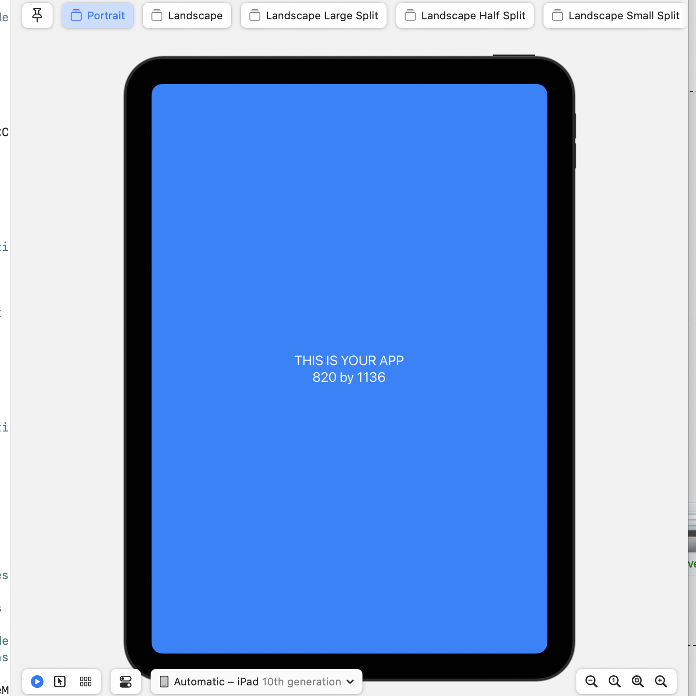
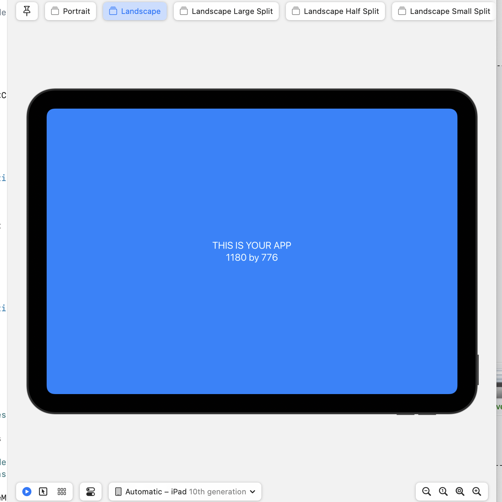

# SwiftUIPreviewLayouts

SwiftUIPreviewLayouts is a Swift package for generating multiple SwiftUI previews for various device layouts and multitasking modes, specifically for iOS.


## Features

- Multiple device types
- Portrait and Landscape layouts
- Multitasking support for iPads

## Installation

```swift
dependencies: [
    .package(url: "https://github.com/Matt54/SwiftUIPreviewLayouts.git", from: "1.0.0")
]
```

## Usage

```swift
import SwiftUI
import SwiftUIPreviewLayouts

struct YourView_Previews: PreviewProvider {
    static var previews: some View {
        PreviewLayouts() {
            YourView()
        }
    }
}
```

## Screenshots

### Portrait



### Landscape



### Landscape Half Split


### Landscape Large Split


### Landscape Slide


### Landscape Small Split


### Portrait Large Split


### Portrait Slide


### Portrait Small Split


## Contributing

Pull requests are welcome.

## License

MIT
